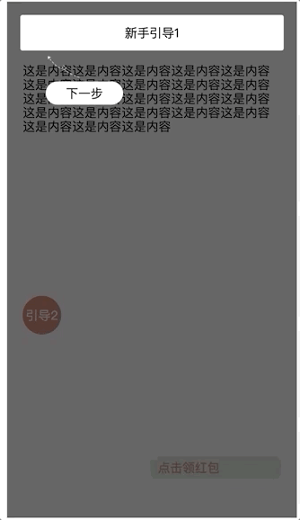

# e-guide-layer
基于vue jsx的新手引导层组件，只需要配置一定的参数即可，项目需要支持vue jsx

## 演示

## 安装
```js
npm install e-guide-layer --save
```
## 使用
```js
import 'e-guide-layer/dist/e-guide-layer.css'
import eGuideLayer from 'e-guide-layer'

Vue.use(eGuideLayer)
```
## dev
```js
// node >=8.9
npm run serve
```
## build
```
npm run build
```
### 基础代码示例
```js
<e-guide-layer
      :current-index.sync="guideActiveIndex"
      :guide-list="guideList"
/>

export default {
    data() {
    return {
      guideActiveIndex: 0,
      guideList: [
        {
          confirmBtnText: '下一步',
          targetDom: '.step1',
          clickHandle: () => {
            this.guideActiveIndex = 1
          }
        },
        {
          confirmBtnText: '下一步',
          targetDom: '.step2',
          clickHandle: () => {
            this.guideActiveIndex = 2
          },
          render: () => {
            return (
              <div
                style="background-color:#fff;"
                onClick={this.step1ClickHandle}
              >
                自定义引导层区域
              </div>
            )
          }
        },
        {
          confirmBtnText: '知道了',
          targetDom: '.step3',
          direction: 'down',
          clickHandle: () => {
            this.guideActiveIndex = 3
          }
        }
      ],
    }
  },

  methods: {

  },
};

```

## API 配置说明

### e-guide-layer  Props
|  参数   | 说明  |  类型  |  默认值  |
|  ----  | ----  | ----  | ----  |
| guide-list  | 引导层配置集合 | Array | [] |
| current-index  | 当前激活的引导层 | Number | 0 |
| z-index  | 引导层最小的z-index值 | Number | 999 |

#### guide-list的GuideItem 配置项
|  参数   | 说明  |  类型  |  默认值  |
|  ----  | ----  | ----  | ----  |
| targetDom  | 引导层指向的节点(class,id,dom) | String | null |
| confirmBtnText  | 引导层确定按钮 | String | 下一步 |
| padding  | 覆盖指向节点的paddng,使产生空隙 | Number | 6 |
| guideImgSrc  | 指向节点与确认按钮之间的图片 | String | 默认箭头图片|
| guideImgHeight  | 指引图片的高度 | String | 30px|
| direction  | 引导指示实在目标的上面还是下面 (up  down) | String | up|
| clickHandle  | 点击引导层确定按钮的事件 | function | null|
| render  | 使用jsx自定义的内容 | function | null|

## License
MIT


